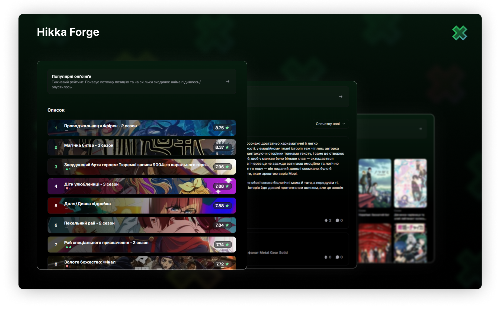

# Hikka Forge


Hikka Forge is a modular browser extension designed to inject custom features and styles into the hikka.io website. It is architected to be extensible, allowing new features (termed "Modules") to be developed and integrated with minimal boilerplate.



## Features

- Recommendations using the custom [anime2vec](https://huggingface.co/Lorg0n/hikka-forge-anime2vec) model.
- Weekly top lists for ongoing anime
- Native Hikka weighted scores instead of MAL ratings.
- Full, searchable users comment history.
- Seasonal thematic logos.

## Getting Started (for Developers)

To get a local copy up and running, follow these simple steps.

### Prerequisites

*   Node.js (LTS version recommended)
*   pnpm (specified as `packageManager` in `package.json`)

### Installation

1.  **Clone the repository:**
    ```bash
    git clone hhttps://github.com/Lorg0n/hikka-forge-extension.git
    cd hikka-forge-extension
    ```
2.  **Install dependencies:**
    ```bash
    pnpm install
    ```

### Development

Hikka Forge uses Vite for a fast development experience with hot module replacement (HMR).

*   **Build with watch mode for extension development:**
    For browser extension development, you'll want to use the `build:watch` scripts which compile the extension files directly into the `dist` folder.

    *   **For Chrome:**
        ```bash
        pnpm build:watch:chrome
        ```
    *   **For Firefox:**
        ```bash
        pnpm build:watch:firefox
        ```

    These commands will watch for changes in your source code and automatically recompile the extension, allowing for quick iteration when testing in the browser.

### Building for Production

To create a production-ready build of the extension:

*   **For Chrome:**
    ```bash
    pnpm build:chrome
    ```
    This will generate the extension files in the `dist/` directory, optimized for Chrome.

*   **For Firefox:**
    ```bash
    pnpm build:firefox
    ```
    This will generate the extension files in the `dist/` directory, optimized for Firefox.

## Loading the Extension in Your Browser

After building the extension (or while using `build:watch`):

### Google Chrome / Chromium-based Browsers

1.  Open Chrome and navigate to `chrome://extensions`.
2.  Enable "Developer mode" in the top-right corner.
3.  Click the "Load unpacked" button.
4.  Navigate to the `dist` directory within your cloned project folder and select it.
5.  The "Hikka Forge" extension should now appear in your list of extensions.

### Mozilla Firefox

1.  Open Firefox and navigate to `about:debugging#/runtime/this-firefox`.
2.  Click the "Load Temporary Add-on..." button.
3.  Navigate to the `dist` directory within your cloned project folder.
4.  Select the `manifest.json` file inside the `dist` folder.
5.  The "Hikka Forge" extension will be loaded. Note that temporary add-ons are removed when Firefox is closed. For persistent loading during development, you might want to use a tool like `web-ext run`.

## Contributing

Contributions are what make the open-source community such an amazing place to learn, inspire, and create. Any contributions you make are **greatly appreciated**.

If you have a suggestion that would make this better, please fork the repo and create a pull request. You can also open an issue with the tag "enhancement".

1.  Fork the Project
2.  Create your Feature Branch (`git checkout -b feature/AmazingFeature`)
3.  Commit your Changes (`git commit -m 'Add some AmazingFeature'`)
4.  Push to the Branch (`git push origin feature/AmazingFeature`)
5.  Open a Pull Request

Please ensure your code adheres to the existing style and pass ESLint checks.

## License

This project is licensed under the MIT License. See the `LICENSE` file

## Acknowledgements

*   [Hikka Features](https://github.com/rosset-nocpes/hikka-features)
*   [React](https://react.dev/)
*   [Vite](https://vitejs.dev/)
*   [TypeScript](https://www.typescriptlang.org/)
*   [Tailwind CSS](https://tailwindcss.com/)
*   [Radix UI](https://www.radix-ui.com/)
*   [lucide-react](https://lucide.dev/icons/)
*   [shadcn/ui](https://ui.shadcn.com/)
